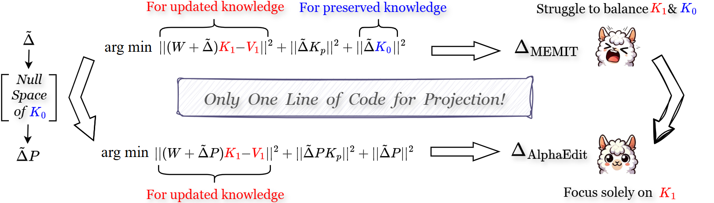

# AlphaEdit
- Code for [``AlphaEdit: Null-Space Constrained Knowledge Editing for Language Models``]

- AlphaEdit minimizes disruption to the preserved knowledge by projecting parameter perturbations onto the null space of its key matrices. It then removes the output error related to it from the current objective, allowing the model to focus solely on knowledge update without trade-off.  By leveraging the mathematical properties of matrix projection and null space, AlphaEdit ensures that the distribution of hidden representations within LLMs remains invariant after edits. This invariance allows post-edited LLMs to effectively handle both knowledge update and preservation simultaneously.
- AlphaEdit focuses on optimizing sequential editing from an objective standpoint. Additionally, we highly recommend our complementary work, [NSE](https://arxiv.org/abs/2410.04045), for readers interested in sequential editing. NSE enhances the process by optimizing both the retrieval of \(z\) values and the updating of weights \(W\), providing seamless integration with AlphaEdit.

*Figure: This is the overall architecture of our AlphaEdit method.*

## Requirements
**At least one A40 48G GPU.**

- pytorch==1.12.1
- einops==0.4.0
- higher==0.2.1
- hydra-core==1.2.0
- transformers==4.23.1
- datasets==1.18.3
- matplotlib==3.6.1
- spacy==3.4.1
- scipy==1.9.2
- scikit-learn==1.0.2
- nltk==3.7

## Quick Start
### An example for editing Llama3 (8B) on counterfact dataset using NSE
#### 1. Edit Llama3 (8B) model 
 
    python3 -m experiments.evaluate     --alg_name=AlphaEdit     --model_name=meta-llama/Meta-Llama-3-8B-Instruct     --hparams_fname=Llama3-8B.json --ds_name=mcf --dataset_size_limit=2000    --num_edits=100 --downstream_eval_steps=5

This command runs an evaluation script for the NSE algorithm using the Llama3-8b-instruct. Below are the explanations for each argument:

- `--alg_name=NSE`: Specifies the name of the algorithm being used, which is NSE in this case.
- `--model_name=meta-llama/Meta-Llama-3-8B-Instruct`: Indicates the name of the model being evaluated, here it is Llama-3-8B-Instruct.
- `--hparams_fname=Llama3-8B.json`: Points to the JSON file containing hyperparameters specific to the Llama-3-8B-Instruct model.
- `--ds_name=mcf`: Specifies the dataset name, in this case, "mcf".
- `--dataset_size_limit=2000`: Sets the total number of editing samples to 2000.
- `--num_edits=100`: Defines the batch size for each round of editing, meaning 100 edits will be performed in each batch. 
- `--downstream_eval_steps=5`: indicates that a test of general capabilities is conducted after every 5 rounds of editing.
#### 2. Summarize the results

    python summarize.py --dir_name=AlphaEdit --runs=run_<run1>,run_<run2>

## Acknowledgment
Our code is based on  [``MEMIT``](https://github.com/kmeng01/memit.git).
